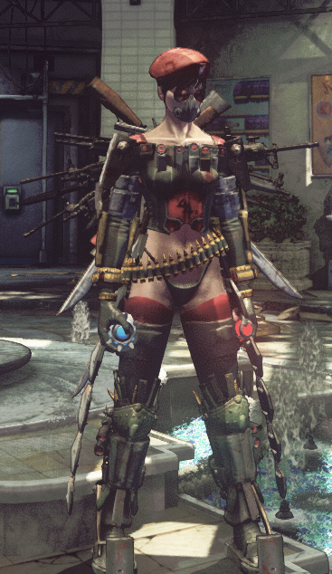
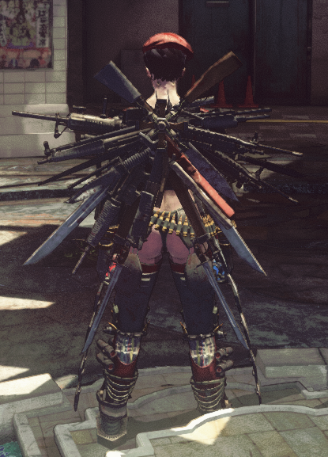
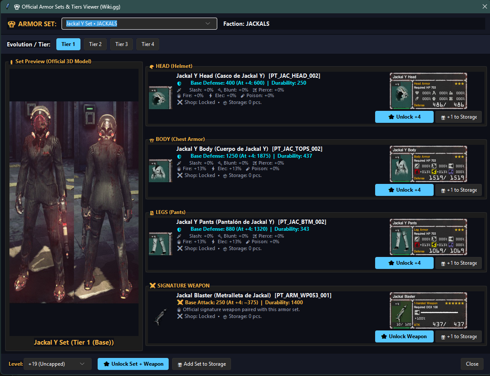
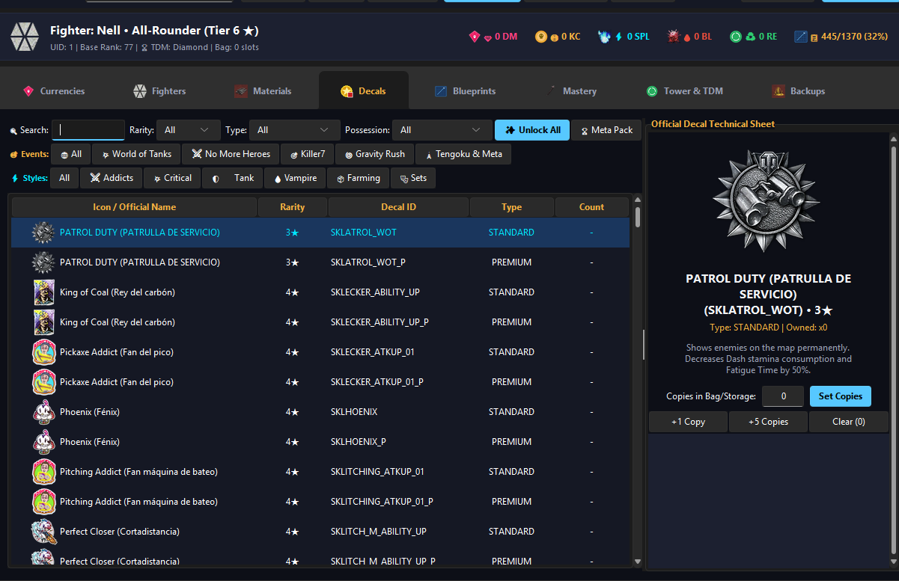
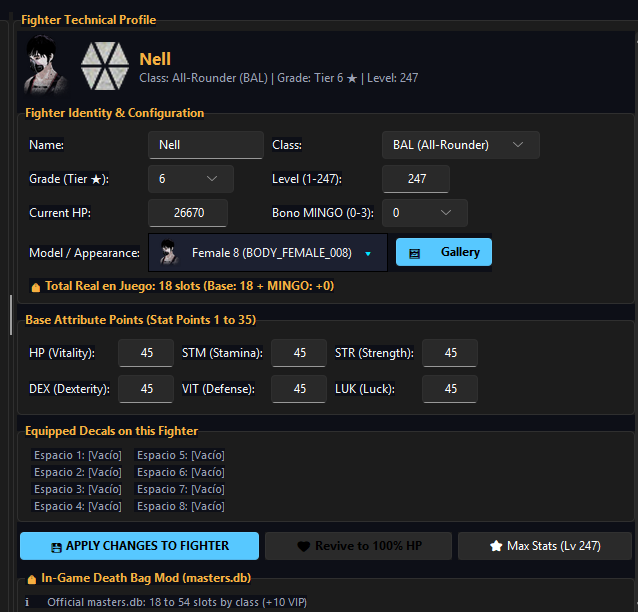
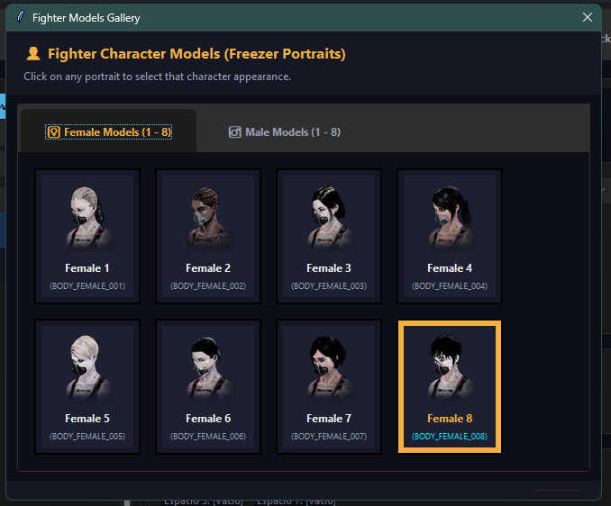
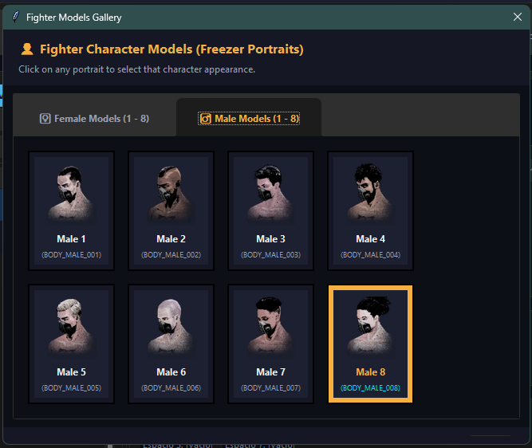

# LET IT DIE - Save Editor and Developer Technical Reference

An open-source desktop application, save manipulation engine, and technical reference suite for inspecting, editing, and repairing PC (Steam) save files for LET IT DIE.

The project operates directly on local `.sav` files, decoding the multi-chunk compressed stream, exposing validated game systems through a modular graphical interface, and repacking modifications with binary parity, atomic file operations, and automated rolling backups.

---

## Visual Showcase

### In-Game Results
Maximized Grade 6 (Tier 8 Uncapped, Level 247) fighter equipped with fully upgraded endgame tactical gear and weapons.

<p align="center">
  
  
</p>

### Armor Sets & Evolution Viewer
Full hierarchy resolution across all 4 evolution tiers. Unlocking high-tier armor sets automatically unlocks ancestor blueprints, signature weapons, and shop forge requirements.



### Decals Encyclopedia & Inventory
Complete database of 626 decals with dedicated filtering for collaborations (World of Tanks, No More Heroes, Killer7, Gravity Rush, Tengoku), playstyles, and batch storage management.



### Fighter Technical Profile & Uncap Editor
Level 247 uncap configuration, base attribute allocation (1 to 45), Death 'Roids synchronization, decal slot expansion, and death bag capacity modifier.



### Fighter Character Model Gallery
Visual freezer portraits for all 16 authentic character meshes (Female 1-8 and Male 1-8).

<p align="center">
  
  
</p>

---

## User Guide (For Players)

### Requirements
- Operating System: Windows 10 or Windows 11 (64-bit).
- Game: LET IT DIE (Steam Edition).
- Administrative privileges (required to read/write Steam AppData directories).

### Quick Start (Standalone Executable)
1. Download the latest compiled release (`LetItDieSaveEditor.exe`) from the [GitHub Releases](https://github.com/g3usyk/Let-It-Die-Save-Editor/releases) page.
2. Place the executable in any directory of your choice.
3. Completely close LET IT DIE before launching the editor to avoid save file access conflicts.
4. Run `LetItDieSaveEditor.exe`.
5. The editor will automatically scan your Steam user directories and detect your active save file.
6. Make your desired modifications across the tabs and click the Save buttons.
7. Launch LET IT DIE.

### Save File Location
The editor automatically searches the default Steam user data directory:
```
C:\Program Files (x86)\Steam\userdata\<your_steam_id>\523660\remote\savedata.sav
```
If you have installed Steam on a secondary drive or use multiple Steam accounts, use the manual file browser button in the application to select your `savedata.sav`.

### Automated Rolling Backups
Safety is enforced on every save operation:
- Before any change is written to disk, an exact binary backup is stored in the `Backups/` directory.
- Backups use timestamped filenames: `savedata_YYYYMMDD_HHMMSS.sav.bak`.
- The system automatically retains the 10 most recent backups and removes older copies.
- If a save ever fails to load in-game, open the Backups tab in the editor and restore any previous point with a single click.

---

## Core Features Breakdown

### 1. Currencies & Facilities
- Kill Coins, Death Metals, SPLithium, Bloodnium, and Recycle Points adjustment.
- Bank and SPL Tank capacity upgrades to official level 99 (10,000,000 capacity).
- Direct Hell Royal Express VIP pass toggle, setting valid forward timestamps and activating VIP privileges.

### 2. Fighter Freezer & Custom Builder
- Full character stats allocation across HP, STR, DEX, VIT, STM, and LUK.
- Grade 6 Level 247 uncap support with synchronized `bodyuser` and `soul.chr` structures to prevent level-up crash loops.
- Visual character model assignment across all 16 official 3D meshes with portrait picker.
- Decal slot expansion up to the maximum 8 slots.
- Fighter cloning, creation wizard, and freezer slot reordering.

### 3. Armor Sets & Evolution Viewer
- Comprehensive catalog of all armor sets categorized by faction (D.O.D. ARMS, War Ensemble, Candle Wolf, M.I.L.K., Jackals, Forcemen).
- Evolution branch navigation (Tier 1 through Tier 4) with 3D model previews.
- One-click set unlocking with ancestor inheritance: unlocking a Tier 4 set automatically registers Tiers 1, 2, and 3 in the Chokufunsha Shop to ensure legitimate game progression.
- Direct delivery of armor pieces and signature weapons to the Coin Locker with customizable levels (+4, +19 Uncapped).

### 4. Decals Encyclopedia
- Database of 626 decals, distinguishing Standard and Premium versions.
- Filters for official collaboration events (World of Tanks, No More Heroes, Killer7, Gravity Rush, Tengoku) and combat styles.
- Batch collection actions: unlock all decals, unlock top-tier meta packs, or inject individual decals into fighter bags or storage.

### 5. Materials, Mushrooms, and Beasts Catalog
- Complete database of 106 R&D crafting materials, 63 mushrooms, and 24 beasts.
- Full support for event mushrooms: Bronze, Silver, and Gold Pumpkinshrooms (`MSR_309`, `MSR_310`, `MSR_311`), Eggshrooms, Snowcaps, and Parasol shrooms.
- Official in-game descriptions and names extracted directly from the game's bilingual database (`master_text`).
- Coin Locker capacity expansion up to 6,000+ slots with safe re-indexing of existing items.
- Quick quantity injection controls (`+10`, `+50`, `+100`, custom input) and missing materials calculation for blueprint R&D.

### 6. Weapon Mastery
- Weapon mastery management across all 57 weapon categories.
- Accurate calculation up to level 20 (base) and level 30 (uncapped) matching official in-game EXP tables.

### 7. Tower of Barbs & Map Utilities
- Complete elevator network activation across all 61 stations.
- Tower map exploration: 980 rooms discovered, 1,119 escalators unlocked, and removal of one-way padlock restriction bits.
- 122 one-way shortcut gates and valves opened.
- Stamp Rally completion and prologue tutorial lockout removal for clean Waiting Room spawns on fresh saves.

### 8. TDM Simulation & Defense
- Rank, TDM points, and win/loss statistics editing.
- Defense simulation with custom simulated attackers and dummy defender templates.

---

## Technical Architecture (For Developers)

The codebase is structured into modular layers following clean separation of concerns:

```
                      +------------------------------------------+
                      |         editor_gui.py (Main Window)      |
                      |   Orchestration, Event Bus, Save Cycle   |
                      +------------------------------------------+
                                           |
                 +-------------------------+-------------------------+
                 |                                                   |
+---------------------------------+                 +---------------------------------+
|          ui/tabs/ & ui/         |                 |             core/               |
|      Domain Mixin UI Layer      |                 |    Pure Mutation Business Logic |
| - CurrenciesTabMixin            |                 | - currencies.py                 |
| - FightersTabMixin              |                 | - fighters.py                   |
| - MaterialsTabMixin             |                 | - storage.py                    |
| - DecalsTabMixin                |                 | - decals.py                     |
| - BlueprintsTabMixin            |                 | - blueprints.py                 |
| - MasteryTabMixin               |                 | - mastery.py                    |
| - TowerTabMixin                 |                 | - tower.py                      |
| - AdvancedTabMixin              |                 | - helpers.py                    |
+---------------------------------+                 +---------------------------------+
                 |                                                   |
                 +-------------------------+-------------------------+
                                           |
                      +------------------------------------------+
                      |                 save_io.py               |
                      |   Binary Multi-Chunk ZLIB I/O & Backups  |
                      +------------------------------------------+
                                           |
                      +------------------------------------------+
                      |            SQLite masters.db             |
                      |    Official Game Static Data & Text      |
                      +------------------------------------------+
```

### 1. UI Layer & Domain Mixin Pattern (`ui/`)
The interface uses Python's native Tkinter and TTK with a dark cyberpunk visual palette defined in `ui/theme.py`. Rather than creating a single monolithic GUI class, tabs are implemented as isolated mixin classes:
- **`ui/tabs/`**: Each tab (`CurrenciesTabMixin`, `FightersTabMixin`, `MaterialsTabMixin`, `DecalsTabMixin`, `BlueprintsTabMixin`, `MasteryTabMixin`, `TowerTabMixin`, `AdvancedTabMixin`) encapsulates its own widgets, state filters, and event bindings.
- **`editor_gui.py`**: The `SaveEditorGUI` class inherits from `tk.Tk` and all tab mixins. It acts as the central coordinator, managing top-level application state (`self.save_json`), file lifecycle, background database loading, and modal dialog dispatching.
- **`ui/dialogs/`**: Standalone modal dialogs for complex interactions (`armor_set_viewer.py`, `create_fighter.py`, `inventory_viewer.py`, `smart_analyzer.py`).

### 2. Pure Core Logic Layer (`core/`)
All save mutations are strictly decoupled from the UI. Functions in `core/` receive the loaded Python dictionary (`save_json`), apply safe transformations, and return calculated status values without depending on Tkinter:
- **`core/fighters.py`**: Attribute point calculation, level formulas, Death 'Roids uncap synchronization, and slot management.
- **`core/storage.py`**: Storage slot assignment, typing, capacity expansion, and item injection.
- **`core/blueprints.py`**: Evolution DAG traversal, shop forge level mapping, and durability flags.
- **`core/currencies.py`**: Financial adjustments and facility boundary validation.
- **`core/tower.py`**: Map bitmask transformations, gate status, and quest flags.
- **`core/helpers.py`**: Save schema repair and UID resolution.

### 3. Save File Binary Wire Format (`save_io.py`)
LET IT DIE uses a proprietary binary container format for its `.sav` files:

```
 0                   1                   2                   3
 0 1 2 3 4 5 6 7 8 9 0 1 2 3 4 5 6 7 8 9 0 1 2 3 4 5 6 7 8 9 0 1
+-+-+-+-+-+-+-+-+-+-+-+-+-+-+-+-+-+-+-+-+-+-+-+-+-+-+-+-+-+-+-+-+
|       'B'     |       'R'     |       'G'     |      0x00     |  Header Magic (4 bytes)
+-+-+-+-+-+-+-+-+-+-+-+-+-+-+-+-+-+-+-+-+-+-+-+-+-+-+-+-+-+-+-+-+
|                       Format Version (uint32)                 |  Format Version (4 bytes)
+-+-+-+-+-+-+-+-+-+-+-+-+-+-+-+-+-+-+-+-+-+-+-+-+-+-+-+-+-+-+-+-+
|                 Total Uncompressed JSON Byte Size             |  Payload Size (4 bytes)
+-+-+-+-+-+-+-+-+-+-+-+-+-+-+-+-+-+-+-+-+-+-+-+-+-+-+-+-+-+-+-+-+
|       'Z'     |       'L'     |       'I'     |       'B'     |  Codec Identifier (4 bytes)
+-+-+-+-+-+-+-+-+-+-+-+-+-+-+-+-+-+-+-+-+-+-+-+-+-+-+-+-+-+-+-+-+
|                   Chunk 0 Uncompressed Length                 |  Chunk 0 Header (4 bytes)
+-+-+-+-+-+-+-+-+-+-+-+-+-+-+-+-+-+-+-+-+-+-+-+-+-+-+-+-+-+-+-+-+
|                    Chunk 0 Compressed Length                  |  Chunk 0 Header (4 bytes)
+-+-+-+-+-+-+-+-+-+-+-+-+-+-+-+-+-+-+-+-+-+-+-+-+-+-+-+-+-+-+-+-+
|                 Chunk 0 Zlib Compressed Payload               |  Variable length
|                             ...                               |
+-+-+-+-+-+-+-+-+-+-+-+-+-+-+-+-+-+-+-+-+-+-+-+-+-+-+-+-+-+-+-+-+
|                   Chunk N Uncompressed Length                 |  Chunk N Header (4 bytes)
+-+-+-+-+-+-+-+-+-+-+-+-+-+-+-+-+-+-+-+-+-+-+-+-+-+-+-+-+-+-+-+-+
|                    Chunk N Compressed Length                  |  Chunk N Header (4 bytes)
+-+-+-+-+-+-+-+-+-+-+-+-+-+-+-+-+-+-+-+-+-+-+-+-+-+-+-+-+-+-+-+-+
|                 Chunk N Zlib Compressed Payload               |  Variable length
+-+-+-+-+-+-+-+-+-+-+-+-+-+-+-+-+-+-+-+-+-+-+-+-+-+-+-+-+-+-+-+-+
|                          0x00000000                           |  EOF Trailer (4 bytes)
+-+-+-+-+-+-+-+-+-+-+-+-+-+-+-+-+-+-+-+-+-+-+-+-+-+-+-+-+-+-+-+-+
```

- **Decompression**: The reader parses the 16-byte magic header, verifies `BRG\0` and `ZLIB`, then streams chunks sequentially. When a chunk descriptor reading `uncompressed_size == 0` is reached, decompression terminates.
- **Compression**: The uncompressed UTF-8 JSON stream is divided into 4 balanced chunks. Each chunk is compressed using `zlib.compressobj(level=6)` and packed with its uncompressed and compressed byte lengths.
- **Atomic Writing**: Modified files are written to a unique temporary file (`.tmp_<uuid>.sav`) before an atomic rename (`os.replace`) commits the save. This guarantees that process termination or system power loss can never leave a partially written or corrupt file on disk.

---

## Critical Game Engine Mechanics & Bug Fixes

### 1. Engine Msgpack Empty Array Serialization (`part.pts`)
A known issue in the game's serializer causes empty container arrays to be written as empty dictionaries (`{}`) instead of empty lists (`[]`). 
- When an equipment category in `save_json["part"]["pts"][uid]` has zero items, the engine may serialize it as `{}`.
- Attempting to append an item directly causes `AttributeError: 'dict' object has no attribute 'append'`.
- The editor solves this systematically via `get_or_create_list(parent, key)`, which normalizes empty dicts to `[]` prior to insertion, and applies an automatic schema repair pass when loading any save file.

### 2. Fighter Level Calculation and Level-Up Crash Loop
The game engine computes a fighter's displayed level dynamically using the formula:
$$\text{Level} = \text{BaseLevel} + \sum (\text{AttributePoints} - 1)$$

For Grade 6 fighters, uncapping to Tier 8 allows attribute levels up to 45 (max level 247). A critical crash occurred in previous save editing tools when attributes in `bodyuser[uid].hab` were raised beyond level 25 without properly unlocking the corresponding skill slots in `soul.chr.chrs[uid].lvl` and `bodylvl_limit_break`:
- If `hab` points were raised directly, the game would attempt to request Death 'Roids at the Fighter Freezer to process the uncap.
- This triggered an unhandled exception in the game's level progression routine, causing the game to crash on boot or freeze during the level-up cutscene.
- **Solution**: The editor's `set_fighter_stats()` and `max_fighter_stats()` functions now perform complete dual-layer synchronization:
  1. Sets all 6 attributes in `bodyuser[uid].hab` to 45.
  2. Unlocks all 120 skill limit break nodes in `soul.chr.chrs[uid].lvl` and `bodylvl_limit_break`.
  3. Sets `bodyuser[uid].m_level` to 247, preventing the game from entering a corrupted level-up check state.

### 3. Hierarchical Evolution Branching in Armor Sets
Equipment in LET IT DIE progresses through non-linear evolution trees (Tier 1 Base -> Tier 2 -> Tier 3 -> Tier 4). 
- In the game's Chokufunsha Shop, unlocking a Tier 4 item requires preceding blueprint registrations.
- The editor's Armor Sets Viewer implements ancestor branch traversal (`auto_unlock_ancestors=True`):
  Unlocking any Tier 4 piece or weapon automatically resolves its predecessor chain through `nextptid` references in `masters.db` and registers Tiers 1, 2, and 3 at Level 5 (+4 CHARGE), ensuring that the shop state remains legitimate and fully usable.

### 4. Coin Locker Structure and Typed Slots
The Coin Locker (`save_json["soul"]["cl"]`) is an indexed array of slot objects:
```json
{
  "slot": 0,
  "type": 1,
  "eid": "d4e2b027-2dc0-449e-8c3b-741a3bc8c19a"
}
```
Slot types are strictly differentiated:
- `type: 0`: Equipment (`part.pts`).
- `type: 1`: Mushrooms (`mushroom.msrs`).
- `type: 2`: Beasts (`beast.bsts`).
- `type: 3`: Crafting Materials (`item.items`).
- `type: -1`: Empty slot (`eid: ""`).

When adding items or expanding capacity, the editor rebuilds `soul.cl` by sorting occupied items first, preserving all unique entity IDs (`eid`), and padding or trimming empty slots to match the requested capacity limit. If `masters.db` is present, it updates `COINLOCKER_EXPAND_LIMIT_COUNT` in `master_const_int` to match.

---

## Directory Structure

```
.
├── core/                           # Pure core business logic for save mutations
│   ├── __init__.py                 # Core API exports
│   ├── blueprints.py               # Equipment R&D, forge recipes, and uncapping
│   ├── currencies.py               # KC, DM, SPL, Bloodnium, and facility limits
│   ├── decals.py                   # Decal collection, inventory, and presets
│   ├── fighters.py                 # Fighter attributes, level-up uncap, and freezer
│   ├── helpers.py                  # UID resolution and schema repair
│   ├── mastery.py                  # Weapon mastery formulas and calculations
│   ├── storage.py                  # Materials, mushrooms, beasts, and coin locker
│   ├── tdm.py                      # TDM ranking, attack/defense simulation
│   └── tower.py                    # Elevators, 980-room map, gates, and tutorial flags
├── ui/                             # User interface presentation layer
│   ├── components/                 # Reusable Tkinter custom widgets
│   │   ├── __init__.py
│   │   ├── image_combobox.py       # Combobox with embedded thumbnails
│   │   └── scrollable_frame.py     # Canvas-based smooth scrollable container
│   ├── dialogs/                    # Specialized modal windows
│   │   ├── __init__.py
│   │   ├── armor_set_viewer.py     # 4-tier armor evolution and set viewer
│   │   ├── create_fighter.py       # Custom fighter creation wizard
│   │   ├── fighter_model_gallery.py# 16 visual character model portrait selector
│   │   ├── inventory_viewer.py     # Comprehensive inventory and storage browser
│   │   └── smart_analyzer.py       # Blueprint R&D material requirement calculator
│   ├── tabs/                       # Modular notebook tab mixins
│   │   ├── __init__.py             # Mixin exports
│   │   ├── advanced_tab.py         # Rolling backups manager and JSON export/import
│   │   ├── blueprints_tab.py       # 1,370 equipment items, uncap, and forge actions
│   │   ├── currencies_tab.py       # Resources, bank/tank upgrades, and VIP pass
│   │   ├── decals_tab.py           # 626 decals, filters, and preset equipment
│   │   ├── fighters_tab.py         # Fighter freezer, slots, stats, and reordering
│   │   ├── mastery_tab.py          # Weapon mastery table and bulk setters
│   │   ├── materials_tab.py        # 106 materials, 63 mushrooms, 24 beasts catalog
│   │   └── tower_tab.py            # Elevators, stamps, quests, and TDM configuration
│   └── theme.py                    # Dark cyberpunk visual theme and TTK styles
├── tests/                          # Automated unit test suite
│   ├── __init__.py
│   ├── test_blueprints.py          # Blueprint evolution and uncap validation
│   ├── test_currencies.py          # Resource boundaries and VIP logic
│   ├── test_decals.py              # Decal loading and preset equipping
│   ├── test_fighters.py            # Fighter stats, uncap math, and fresh save
│   ├── test_helpers.py             # UID extraction and schema repair
│   ├── test_i18n.py                # Translation key parity and formatting
│   ├── test_mastery.py             # Weapon mastery calculations
│   ├── test_save_io.py             # Binary compression roundtrip and backups
│   ├── test_storage.py             # Storage additions and capacity expansion
│   ├── test_tdm.py                 # TDM rank and point calculation
│   └── test_tower.py               # Elevators, gates, and tutorial unlock flags
├── docs/                           # Technical documentation and assets
│   ├── images/                     # Screenshots and interface diagrams
│   ├── ADVANCED_GAME_FEATURES_AND_SOUL_MODIFIERS.md
│   ├── GAME_DATABASE_VERIFIED_NOTES.md
│   └── LET_IT_DIE_COMPLETE_ENCYCLOPEDIA.md
├── editor_gui.py                   # Main GUI entrypoint and window orchestrator
├── save_io.py                      # Binary save decompressor, compressor, and atomic writer
├── modifiers.py                    # Compatibility facade re-exporting core functions
├── game_data.py                    # Static game enumerations and class definitions
├── i18n.py                         # Bilingual internationalization engine (EN / ES)
├── build_exe.py                    # PyInstaller standalone build configuration
├── run_tests.py                    # Test runner executing all unit tests
├── requirements.txt                # Python package dependencies
├── version.json                    # Application metadata, version, and changelog
├── all_blueprints_db.json          # Pre-compiled database of 1,370 equipment items
├── all_decals_db.json              # Pre-compiled database of 626 decals
├── all_materials_db.json           # Pre-compiled database of 106 crafting materials
├── all_shrooms_beasts_db.json      # Pre-compiled database of 63 mushrooms and 24 beasts
└── tower_map_data.json             # Pre-compiled indices for 980 rooms and 1,119 escalators
```

---

## Development Setup & Testing Pipeline

### 1. Clone & Environment Setup
```bash
git clone https://github.com/g3usyk/Let-It-Die-Save-Editor.git
cd Let-It-Die-Save-Editor
python -m venv venv
venv\Scripts\activate
pip install -r requirements.txt
```

### 2. Running from Source
```bash
python editor_gui.py
```

### 3. Automated Test Suite
The project maintains an automated test suite with 66 tests covering binary compression, schema repairs, fighter formulas, and storage operations:
```bash
python run_tests.py
```
Or directly via `unittest`:
```bash
python -m unittest discover tests
```
All pull requests must pass all 66 tests before merging.

### 4. Compiling the Standalone Executable
The project uses PyInstaller via `build_exe.py` to generate the standalone Windows executable:
```bash
python build_exe.py --onefile
```
The resulting executable is generated in:
```
dist\LetItDieSaveEditor.exe
```

---

## Contribution Guidelines

1. **Pure Core Logic**: Keep modifications inside `core/` completely pure without UI dependencies. Functions must accept `save_json` as their first argument, handle missing keys defensively using `.setdefault()` or `get_or_create_list()`, and mutate state safely.
2. **Schema Defensive Programming**: Always account for msgpack empty container anomalies (empty dict `{}` vs empty list `[]`).
3. **Bilingual Requirement**: All user-facing strings must use `i18n.t("key_name")` with definitions provided in both English and Spanish in `i18n.py`.
4. **Test Coverage**: Any new feature or bug fix must include a corresponding test in `tests/`.

---

## Acknowledgements

- **Stephengw3** ([GitHub](https://github.com/Stephengw3) / Reddit): Diagnosed the root cause of the Royal Express VIP elevator animation freeze (`soul.vip.friendship`), resolving the attendant loading stall.

---

## License & Disclaimer

This project is an independent open-source tool developed for educational, analytical, and single-player modding purposes. It is not affiliated with, endorsed by, or connected to Grasshopper Manufacture, Supertrick Games, or GungHo Online Entertainment.
